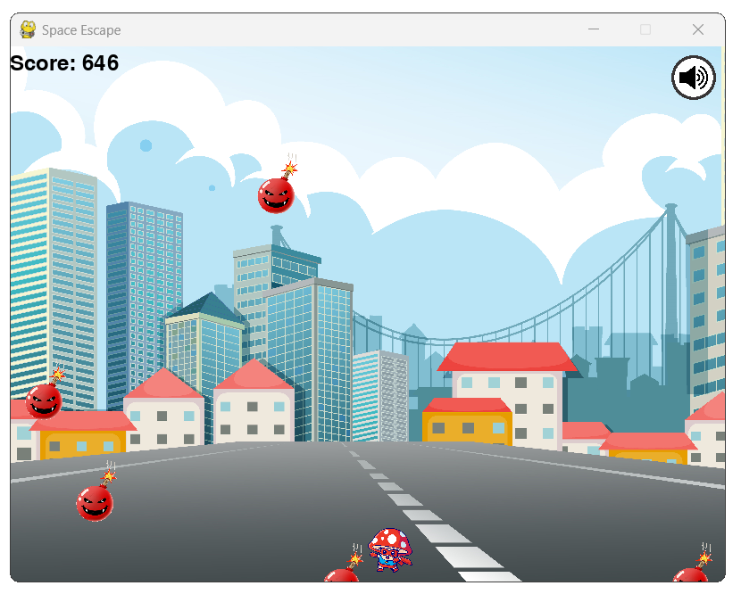

# Game Space Escape

**Game Space Escape** é um jogo desenvolvido utilizando a biblioteca **Pygame**. O objetivo do jogo é desviar das bombas que caem do topo da tela, controlando um personagem na parte inferior. 

<details>
<summary>1 - Como Funciona o Projeto Game Space Escape?</summary>

O jogo apresenta:
- Menu principal com opções para iniciar ou sair do jogo.
- Inimigos (bombas) que surgem aleatoriamente e aumentam a dificuldade.
- Som das bombas caindo e explosão ao colidir com o jogador.
- Sistema de pontuação que aumenta conforme o jogador sobrevive.
- Tela de **Game Over** que permite reiniciar o jogo.

## Requisitos

- Python 3.x
- Biblioteca **Pygame**

</details>

<details>
<summary>2 - O que preciso instalar para testar o jogo?</summary>

### Instalação do Python e Pygame no VS Code

1. **Instale o Python**:

   - Baixe e instale a versão mais recente do Python no [site oficial](https://www.python.org/).
   - Durante a instalação, marque a opção **"Add Python to PATH"**.
   
2. **Instale o Visual Studio Code**:

   - Baixe e instale o VS Code no [site oficial](https://code.visualstudio.com/).

3. **Configure o Python no VS Code**:

   - Instale a extensão **Python** no VS Code.
   - Abra o terminal integrado no VS Code (**Ctrl + `**).
   - Verifique se o Python está instalado corretamente:

     ```bash
     python --version
     ```

4. **Instale o Pygame**:
   - No terminal integrado do VS Code, execute:

     ```bash
     pip install pygame
     ```

5. **Como Jogar**:

    - Execute o jogo no VS Code
    - Use as **setas esquerda** e **direita** para mover o personagem.
    - Evite as bombas que caem do topo.
    - Ao colidir com uma bomba, o som de explosão será reproduzido e a tela de "Game Over" aparecerá.
    - Pressione **SPACE** para reiniciar o jogo ou **ESC** para sair no menu principal.

</details>

<details>
<summary>3 - Quais as suas funcionalidades</summary>

## Funcionalidades do Jogo

- **Menu Principal**: 
   - Pressione **SPACE** para iniciar o jogo.
   - Pressione **ESC** para sair.

- **Pontuação Dinâmica**: 
   - Aumenta conforme o tempo que o jogador sobrevive.

- **Inimigos Dinâmicos**:
   - Bombas surgem aleatoriamente e aumentam a dificuldade.

- **Game Over**:
   - Tela com opção de reiniciar pressionando **SPACE**.

## Screenshots
*Insira imagens do jogo aqui.*

## Controles
- **Seta Esquerda**: Move o personagem para a esquerda.
- **Seta Direita**: Move o personagem para a direita.

</details>

<details>
<summary>4 - Como é a explicação do codigo dele?</summary>

## Estrutura do Projeto

````bash
Game_SpaceEscape/
│
├── sounds/
│   ├── explosion.wav
│   └── bomb_fall.wav
├── images/
│   ├── bomb.png
│   └── player.png
└── space_escape.py
````

- **space_escape.py**: Código principal do jogo.
- **explosion.wav**: Som tocado quando o jogador colide com uma bomba.
- **bomb_fall.wav**: Som tocado quando uma bomba é gerada.
- **bomb.png**: Imagem da bomba.
- **player.png**: Imagem do personagem controlado pelo jogador.

## Abaixo está o código-fonte do jogo com explicações em cada parte:

````python
import pygame  # Importa a biblioteca Pygame para o desenvolvimento do jogo
import random  # Usada para gerar números aleatórios
import sys     # Permite sair do programa com sys.exit()
```` 

### Inicializa o Pygame

````python
pygame.init()
````

### Cores utilizadas no jogo

````python
RED = (255, 0, 0)
GREEN = (0, 255, 0)
````

### Configura o Clock para controlar o FPS (Frames por segundo)

````python
clock = pygame.time.Clock()
FPS = 60
````

### Sons do jogo

````
pygame.mixer.init()
explosion_sound = pygame.mixer.Sound("explosion.wav")  # Som ao colidir com uma bomba
bomb_fall_sound = pygame.mixer.Sound("bomb_fall.wav")  # Som das bombas caindo
bomb_fall_sound.set_volume(0.3)  # Ajusta o volume do som das bombas
````

### Imagens do jogo

````python
bomb_image = pygame.image.load("bomb.png")  # Carrega a imagem da bomba
bomb_image = pygame.transform.scale(bomb_image, (50, 50))  # Redimensiona a imagem para 50x50
````

### Fontes usadas no jogo

````python
font = pygame.font.Font(None, 74)  # Fonte para títulos
small_font = pygame.font.Font(None, 36)  # Fonte para textos menores
````

### Função para desenhar texto na tela

````python
def draw_text(text, font, color, x, y):
    rendered_text = font.render(text, True, color)
    screen.blit(rendered_text, (x, y))
  ````

### Função para gerar inimigos (bombas)

````python
def spawn_enemy(enemy_list, speed):
    x = random.randint(0, WIDTH - 50)  # Posição horizontal aleatória
    y = random.randint(-100, -40)     # Posição inicial fora da tela
    bomb_fall_sound.play()  # Toca o som da bomba caindo
    enemy_list.append([x, y, speed])
  ````

### Função para mover os inimigos para baixo

````python
def move_enemies(enemy_list):
    for enemy in enemy_list:
        enemy[1] += enemy[2]  # Incrementa a posição vertical (move a bomba para baixo)
````

### Função para verificar colisão entre o jogador e as bombas

````python
def check_collision(player_rect, enemies):
    for enemy in enemies:
        if player_rect.colliderect(pygame.Rect(enemy[0], enemy[1], 50, 50)):
            return True
    return False
````

### Tela de Game Over

````python
def game_over_screen(score):
    screen.fill(BLACK)
    draw_text("GAME OVER", font, RED, WIDTH // 2 - 150, HEIGHT // 2 - 50)
    draw_text(f"Score: {score}", small_font, WHITE, WIDTH // 2 - 80, HEIGHT // 2 + 30)
    draw_text("Press SPACE to Restart", small_font, WHITE, WIDTH // 2 - 150, HEIGHT // 2 + 80)
    pygame.display.update()
    waiting = True
    while waiting:
        for event in pygame.event.get():
            if event.type == pygame.QUIT:
                pygame.quit()
                sys.exit()
            if event.type == pygame.KEYDOWN and event.key == pygame.K_SPACE:
                waiting = False
````

### Função do menu principal

````python
def main_menu():
    run = True
    while run:
        screen.fill(BLACK)
        draw_text("Space Escape", font, WHITE, 250, 200)
        draw_text("Press SPACE to Start", small_font, WHITE, 260, 300)
        draw_text("Press ESC to Exit", small_font, WHITE, 270, 350)
        pygame.display.update()
        
        for event in pygame.event.get():
            if event.type == pygame.QUIT or (event.type == pygame.KEYDOWN and event.key == pygame.K_ESCAPE):
                pygame.quit()
                sys.exit()
            if event.type == pygame.KEYDOWN and event.key == pygame.K_SPACE:
                run = False
````

### Loop principal do jogo

````python
def game_loop():
    player = pygame.Rect(WIDTH // 2, HEIGHT - 60, 50, 50)  # Define a posição inicial do jogador
    player_speed = 5
    player_image = pygame.image.load("player.png")  # Carrega a imagem do jogador
    player_image = pygame.transform.scale(player_image, (50, 50))

    enemy_list = []  # Lista para armazenar os inimigos
    spawn_timer = 0  # Timer para controle de geração de inimigos
    score = 0  # Variável para armazenar a pontuação

    run = True
    while run:
        screen.fill(BLACK)
        
        for event in pygame.event.get():
            if event.type == pygame.QUIT:
                pygame.quit()
                sys.exit()

        keys = pygame.key.get_pressed()  # Detecta as teclas pressionadas
        if keys[pygame.K_LEFT] and player.left > 0:
            player.move_ip(-player_speed, 0)
        if keys[pygame.K_RIGHT] and player.right < WIDTH:
            player.move_ip(player_speed, 0)

        spawn_timer += 1
        if spawn_timer > 30:
            spawn_enemy(enemy_list, random.randint(3, 8))
            spawn_timer = 0
        move_enemies(enemy_list)

        for enemy in enemy_list:
            screen.blit(bomb_image, (enemy[0], enemy[1]))

        if check_collision(player, enemy_list):
            explosion_sound.play()
            game_over_screen(score)
            return

        score += 1
        draw_text(f"Score: {score}", small_font, WHITE, 10, 10)
        screen.blit(player_image, player)
        pygame.display.update()
        clock.tick(FPS)
````

### Main

````python
if __name__ == "__main__":
    while True:
        main_menu()
        game_loop()
````

### Controles

````python
- **Seta Esquerda**: Move o personagem para a esquerda.
- **Seta Direita**: Move o personagem para a direita.
````
</details>

<details>
<summary>5 - Imagens do Jogo</summary>

### Tela Inicial


### Tela do Jogo



### Tela Game Over


</details>

## Autora

Desenvolvido por **Anália Emilia Souza**.
Divirta-se com o jogo **Game Space Escape**! :)

